# 🏗️ Quay Crane Real-Time Monitoring System

> End-to-End Data Engineering Project: Real-time IoT sensor streaming, processing, and visualization for port quay crane operations.

[](https://www.docker.com/)
[](https://kafka.apache.org/)
[](https://spark.apache.org/)
[](https://www.elastic.co/)
[](https://www.elastic.co/kibana)

---

## 📋 Table of Contents

- [Overview](#-overview)
- [Architecture](#-architecture)
- [Tech Stack](#-tech-stack)
- [Project Structure](#-project-structure)
- [Data Flow](#-data-flow)
- [Getting Started](#-getting-started)
- [Kafka Topics](#-kafka-topics)
- [Elasticsearch Indices](#-elasticsearch-indices)
- [Kibana Dashboards](#-kibana-dashboards)
- [Monitoring](#-monitoring)
- [Configuration](#-configuration)
- [Troubleshooting](#-troubleshooting)

---

## 🎯 Overview

This project implements a **complete real-time data pipeline** for monitoring quay crane operations at a container port. It simulates IoT sensor data from 6 quay cranes, processes it through Apache Kafka and Spark Structured Streaming, and visualizes insights using the ELK Stack (Elasticsearch, Logstash, Kibana).

### Key Features

- 🔄 **Real-time sensor simulation** for 6 quay cranes with realistic physical constraints
- 📊 **High-throughput streaming** (12 parallel producers, 50 messages/batch/crane)
- ⚡ **Stream processing** with windowed aggregations (1-min, 5-min windows)
- 🚨 **Anomaly detection** and alerting pipeline
- 📈 **Health score calculation** for predictive maintenance
- 📉 **Rich visualizations** with TSVB time series charts
- 🐳 **Fully containerized** infrastructure with Docker Compose

---

## 🏛️ Architecture

### 🐳 Complete Container Infrastructure (17 Services)

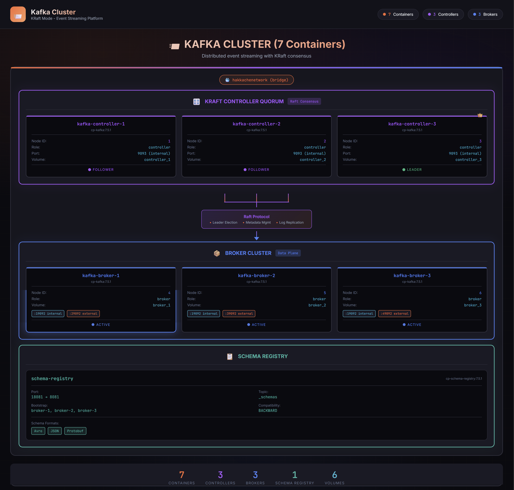

### 🚢 Data Source Layer (IoT Simulation)

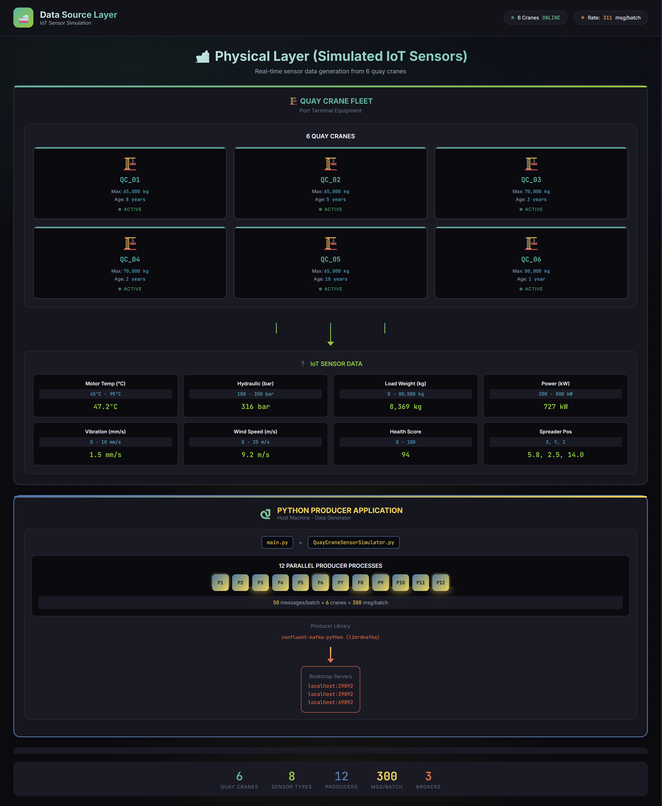

### ⚡ Apache Spark Cluster (4 Containers)

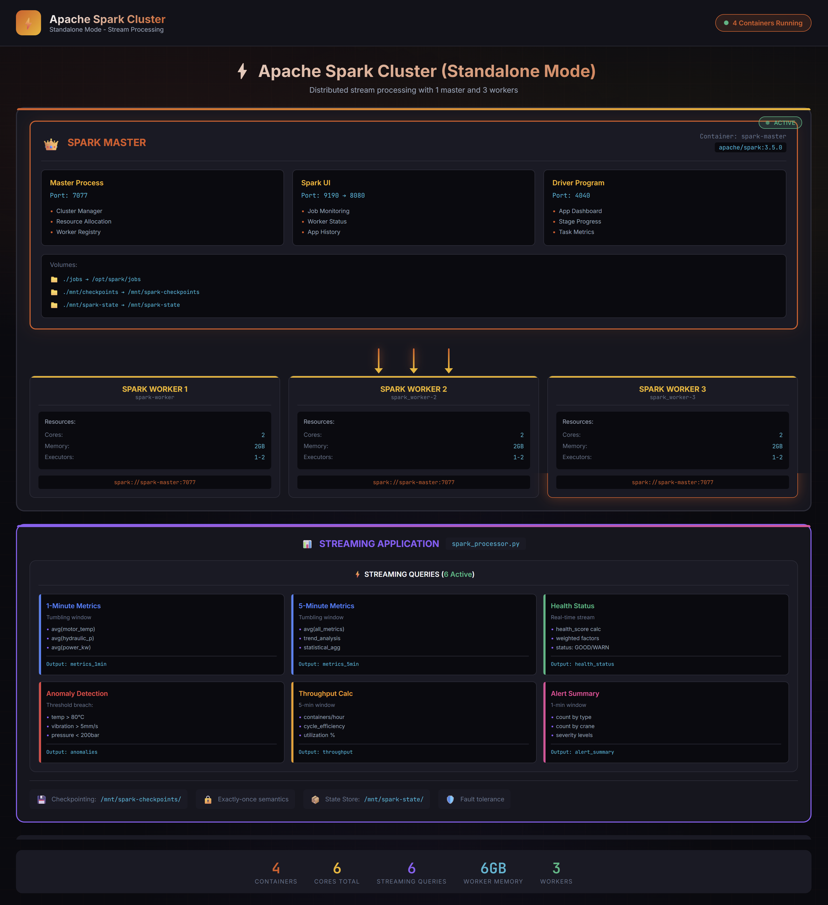

### 📊 ELK Stack (3 Containers)

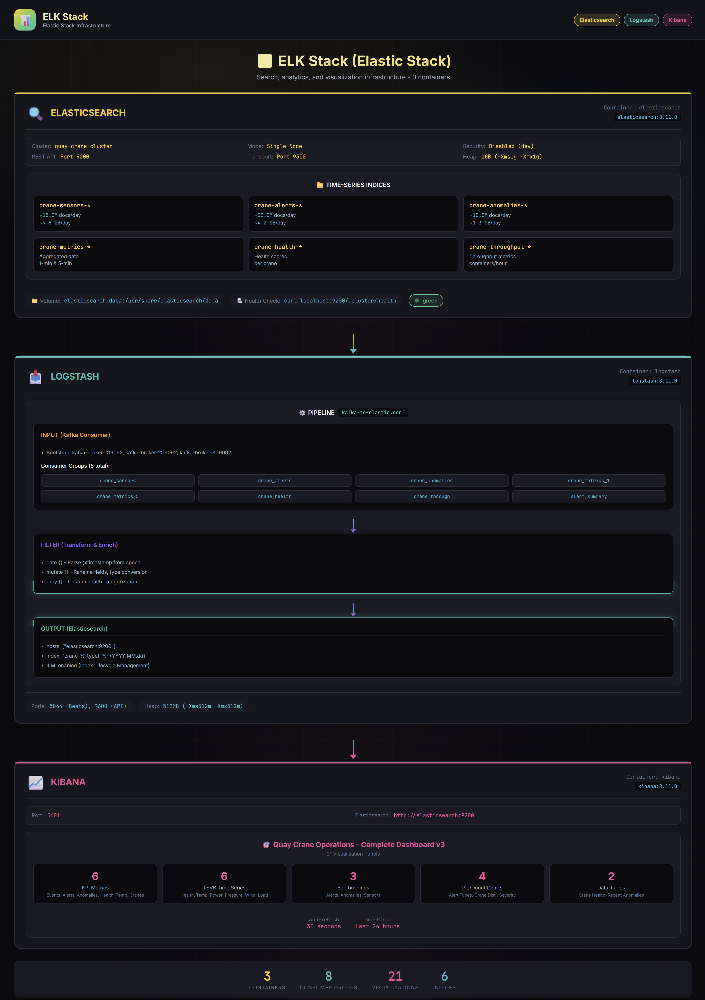

### 🔍 Monitoring & Management Stack (5 Containers)

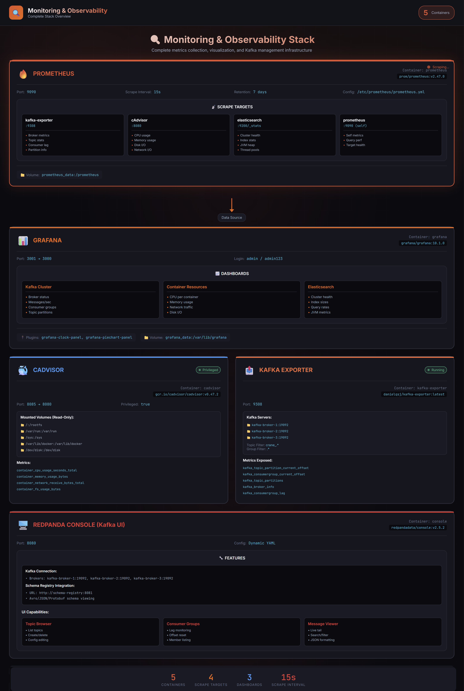

### 🌐 Complete Network Topology

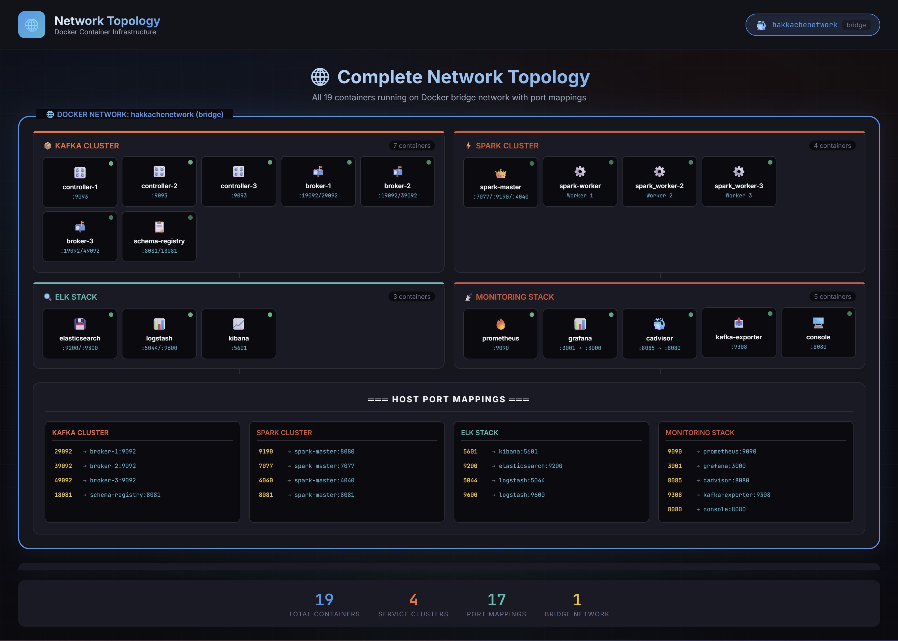

### 📦 Container Summary Table

| Category | Container | Image | Ports (Host→Container) | Purpose |
|----------|-----------|-------|------------------------|---------|
| **Kafka Controllers** | kafka-controller-1 | cp-kafka:7.5.1 | Internal :9093 | Raft consensus node 1 |
| | kafka-controller-2 | cp-kafka:7.5.1 | Internal :9093 | Raft consensus node 2 |
| | kafka-controller-3 | cp-kafka:7.5.1 | Internal :9093 | Raft consensus node 3 |
| **Kafka Brokers** | kafka-broker-1 | cp-kafka:7.5.1 | 29092→9092 | Data broker node 4 |
| | kafka-broker-2 | cp-kafka:7.5.1 | 39092→9092 | Data broker node 5 |
| | kafka-broker-3 | cp-kafka:7.5.1 | 49092→9092 | Data broker node 6 |
| **Schema Registry** | schema-registry | cp-schema-registry:7.5.1 | 18081→8081 | Avro/JSON schema mgmt |
| **Spark Cluster** | spark-master | apache/spark:3.5.0 | 9190→8080, 7077, 4040 | Cluster manager |
| | spark-worker | apache/spark:3.5.0 | - | Worker node 1 |
| | spark_worker-2 | apache/spark:3.5.0 | - | Worker node 2 |
| | spark_worker-3 | apache/spark:3.5.0 | - | Worker node 3 |
| **ELK Stack** | elasticsearch | elasticsearch:8.11.0 | 9200, 9300 | Search & analytics |
| | logstash | logstash:8.11.0 | 5044, 9600 | Data pipeline |
| | kibana | kibana:8.11.0 | 5601 | Visualization |
| **Monitoring** | prometheus | prometheus:v2.47.0 | 9090 | Metrics collection |
| | grafana | grafana:10.1.0 | 3001→3000 | Dashboards |
| | cadvisor | cadvisor:v0.47.2 | 8085→8080 | Container metrics |
| | kafka-exporter | kafka-exporter:latest | 9308 | Kafka metrics |
| | console | redpanda/console:v2.5.2 | 8080 | Kafka UI |

**Total: 17 Containers**

### � Component Interactions & Data Flow

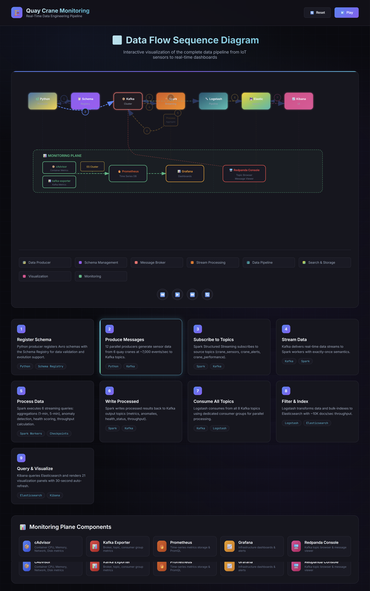

### 📊 Monitoring Plane Interactions


###  Detailed Message Flow Through Kafka Topics

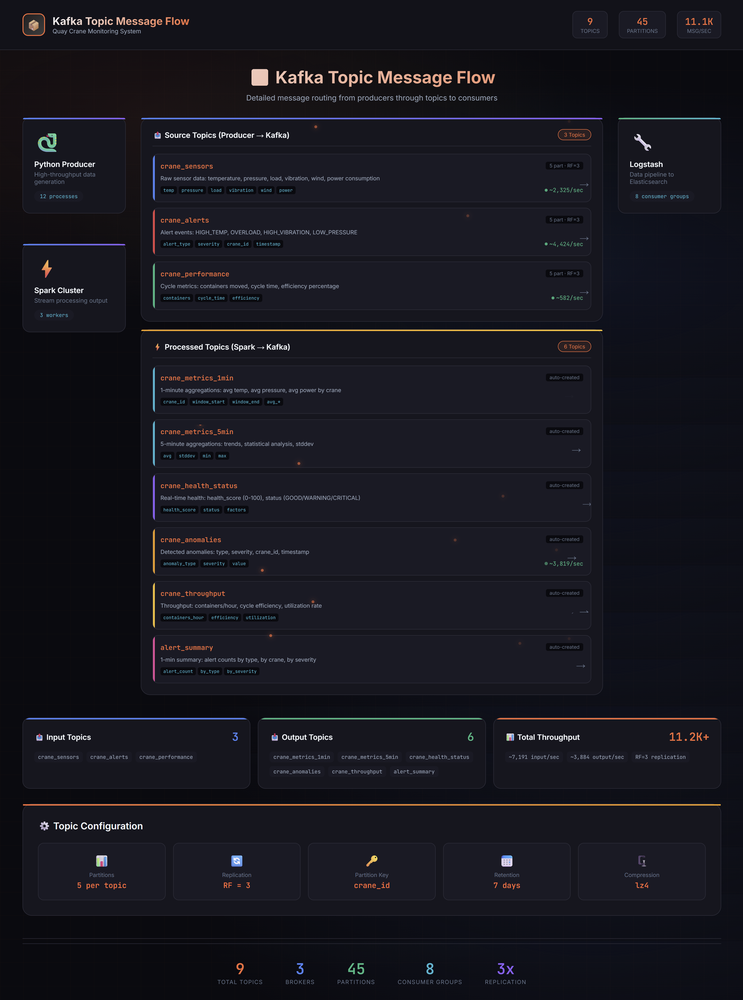

###  Spark Streaming Pipeline Detail

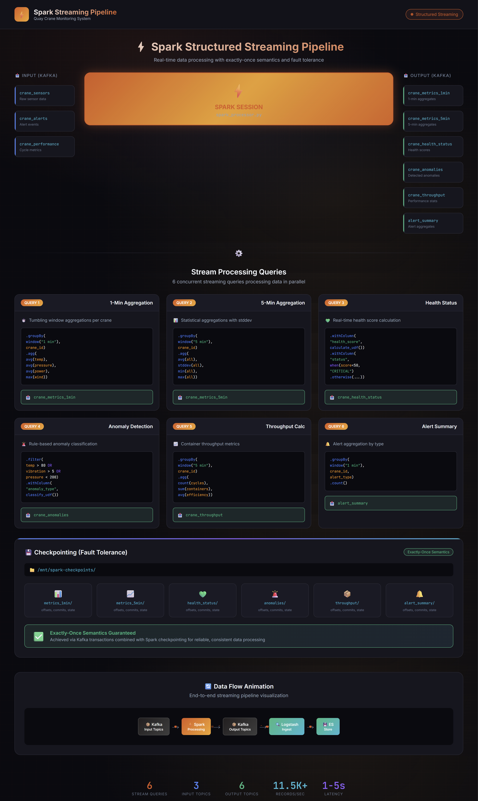

### 📡 Component Communication Matrix

| Source Component | Target Component | Protocol | Port | Data/Purpose |
|-----------------|------------------|----------|------|--------------|
| **Python Producer** | Kafka Brokers | TCP/Kafka | 29092,39092,49092 | Produce sensor/alert/performance messages |
| **Python Producer** | Schema Registry | HTTP | 18081 | Register/retrieve Avro schemas |
| **Kafka Controllers** | Kafka Controllers | TCP/Raft | 9093 (internal) | KRaft consensus, leader election, metadata sync |
| **Kafka Brokers** | Kafka Controllers | TCP | 9093 (internal) | Metadata updates, partition assignment |
| **Kafka Brokers** | Kafka Brokers | TCP | 19092 (internal) | Inter-broker partition replication |
| **Schema Registry** | Kafka Brokers | TCP/Kafka | 19092 (internal) | Store schemas in `_schemas` topic |
| **Spark Master** | Spark Workers | TCP/Spark | 7077 | Job distribution, resource management |
| **Spark Workers** | Kafka Brokers | TCP/Kafka | 19092 (internal) | Subscribe to source topics |
| **Spark Workers** | Kafka Brokers | TCP/Kafka | 19092 (internal) | Write processed data to output topics |
| **Logstash** | Kafka Brokers | TCP/Kafka | 19092 (internal) | Consume from 8 topics (crane_*) |
| **Logstash** | Elasticsearch | HTTP/REST | 9200 (internal) | Bulk index documents |
| **Kibana** | Elasticsearch | HTTP/REST | 9200 (internal) | Query data, manage indices, create visualizations |
| **Redpanda Console** | Kafka Brokers | TCP/Kafka | 19092 (internal) | Browse topics, view messages |
| **Redpanda Console** | Schema Registry | HTTP | 8081 (internal) | View/manage schemas |
| **Prometheus** | cAdvisor | HTTP/Metrics | 8080 (internal) | Scrape container metrics every 15s |
| **Prometheus** | Kafka Exporter | HTTP/Metrics | 9308 (internal) | Scrape Kafka metrics every 15s |
| **Prometheus** | Elasticsearch | HTTP | 9200 (internal) | Scrape ES cluster metrics |
| **Grafana** | Prometheus | HTTP/PromQL | 9090 (internal) | Query time-series data for dashboards |
| **Kafka Exporter** | Kafka Brokers | TCP/Kafka | 19092 (internal) | Collect broker/topic/consumer metrics |
| **cAdvisor** | Docker Socket | Unix Socket | /var/run/docker.sock | Collect container stats |

###  Service Dependency Chain

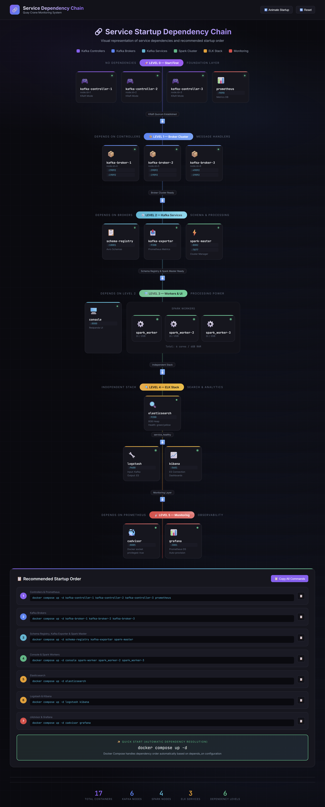

### 🔄 Data Flow Sequence Diagram

```
┌─────────────────────────────────────────────────────────────────────────────────────────────────────────┐
│                                                                                                         │
│                                    DATA FLOW SEQUENCE DIAGRAM                                          │
│                                                                                                         │
│    Python          Schema           Kafka            Spark          Logstash       Elastic        Kibana │
│    Producer        Registry         Cluster          Streaming      Pipeline       search         UI     │
│        │               │               │                │               │             │             │    │
│        │ 1. Register   │               │                │               │             │             │    │
│        │    Schema     │               │                │               │             │             │    │
│        │──────────────>│               │                │               │             │             │    │
│        │<──────────────│               │                │               │             │             │    │
│        │  Schema ID    │               │                │               │             │             │    │
│        │               │               │                │               │             │             │    │
│        │ 2. Produce    │               │                │               │             │             │    │
│        │    messages   │               │                │               │             │             │    │
│        │───────────────────────────────>│                │               │             │             │    │
│        │               │               │                │               │             │             │    │
│        │               │               │ 3. Subscribe   │               │             │             │    │
│        │               │               │<───────────────│               │             │             │    │
│        │               │               │                │               │             │             │    │
│        │               │               │ 4. Stream      │               │             │             │    │
│        │               │               │    data        │               │             │             │    │
│        │               │               │───────────────>│               │             │             │    │
│        │               │               │                │               │             │             │    │
│        │               │               │                │ 5. Process:   │             │             │    │
│        │               │               │                │  • Aggregate  │             │             │    │
│        │               │               │                │  • Anomaly    │             │             │    │
│        │               │               │                │  • Health     │             │             │    │
│        │               │               │                │               │             │             │    │
│        │               │               │ 6. Write       │               │             │             │    │
│        │               │               │    processed   │               │             │             │    │
│        │               │               │<───────────────│               │             │             │    │
│        │               │               │                │               │             │             │    │
│        │               │               │ 7. Consume     │               │             │             │    │
│        │               │               │    all topics  │               │             │             │    │
│        │               │               │───────────────────────────────>│             │             │    │
│        │               │               │                │               │             │             │    │
│        │               │               │                │               │ 8. Filter   │             │    │
│        │               │               │                │               │    & Index  │             │    │
│        │               │               │                │               │────────────>│             │    │
│        │               │               │                │               │             │             │    │
│        │               │               │                │               │             │ 9. Query &  │    │
│        │               │               │                │               │             │    Visualize│    │
│        │               │               │                │               │             │<────────────│    │
│        │               │               │                │               │             │             │    │
│        │               │               │                │               │             │────────────>│    │
│        │               │               │                │               │             │  Dashboard  │    │
│        ▼               ▼               ▼                ▼               ▼             ▼             ▼    │
│                                                                                                         │
│   ┌──────────────────────────────────────────────────────────────────────────────────────────────────┐  │
│   │                                  MONITORING PLANE                                                 │  │
│   │                                                                                                   │  │
│   │   cAdvisor ─────────────┐                                                                        │  │
│   │   (Container Metrics)    │                                                                        │  │
│   │                          │                                                                        │  │
│   │   kafka-exporter ────────┼──────────> Prometheus ──────────> Grafana                             │  │
│   │   (Kafka Metrics)        │            (Time Series DB)       (Dashboards)                        │  │
│   │                          │                                                                        │  │
│   │   Elasticsearch ─────────┘                                                                        │  │
│   │   (Cluster Stats)                                                                                 │  │
│   │                                                                                                   │  │
│   │   Redpanda Console ──────────────────> Direct Kafka Access (Topic Browser, Message Viewer)       │  │
│   │                                                                                                   │  │
│   └──────────────────────────────────────────────────────────────────────────────────────────────────┘  │
│                                                                                                         │
└─────────────────────────────────────────────────────────────────────────────────────────────────────────┘
```

###  Real-Time Data Volumetry

Based on actual production measurements, the system handles the following data throughput:

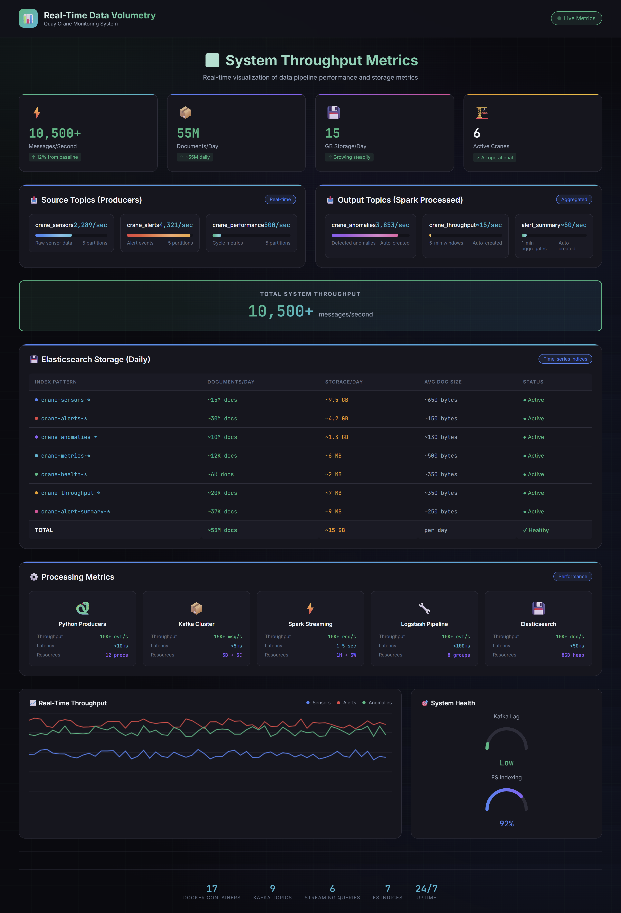

### 📈 Data Flow Rates Summary

| Stage | Input Rate | Output Rate | Latency | Notes |
|-------|------------|-------------|---------|-------|
| **IoT Simulation** | N/A | ~7,000 events/sec | <5ms | 6 cranes × 12 producers |
| **Kafka Ingestion** | ~7,000 msg/sec | ~7,000 msg/sec | <5ms | 5 partitions, RF=3 |
| **Spark Processing** | ~7,000 records/sec | ~4,000 records/sec | 1-5 sec | Windowed aggregations |
| **Logstash Pipeline** | ~10,000 events/sec | ~10,000 docs/sec | <100ms | 8 consumer groups |
| **Elasticsearch** | ~10,000 docs/sec | ~10,000 indexed/sec | <50ms | Bulk indexing |
| **Kibana** | N/A | Real-time queries | <500ms | 30s auto-refresh |

---

## 🛠️ Tech Stack

### Core Infrastructure

| Component | Technology | Version | Container(s) | Purpose |
|-----------|------------|---------|--------------|---------|
| **Message Broker** | Apache Kafka (Confluent) | 7.5.1 | 3 Controllers + 3 Brokers | Event streaming with KRaft mode |
| **Schema Registry** | Confluent Schema Registry | 7.5.1 | 1 | Avro/JSON/Protobuf schema management |
| **Stream Processing** | Apache Spark | 3.5.0 | 1 Master + 3 Workers | Real-time stream processing |
| **Search & Analytics** | Elasticsearch | 8.11.0 | 1 | Time-series data storage & search |
| **Data Pipeline** | Logstash | 8.11.0 | 1 | Kafka → Elasticsearch ingestion |
| **Visualization** | Kibana | 8.11.0 | 1 | Dashboards & analytics |

### Monitoring & Observability

| Component | Technology | Version | Container(s) | Purpose |
|-----------|------------|---------|--------------|---------|
| **Metrics Collection** | Prometheus | v2.47.0 | 1 | Time-series metrics database |
| **Dashboards** | Grafana | 10.1.0 | 1 | Metrics visualization |
| **Container Metrics** | cAdvisor | v0.47.2 | 1 | Docker container resource monitoring |
| **Kafka Metrics** | Kafka Exporter | latest | 1 | Kafka broker/topic metrics for Prometheus |
| **Kafka UI** | Redpanda Console | v2.5.2 | 1 | Kafka topic browser & message viewer |

### Development & Runtime

| Component | Technology | Version | Purpose |
|-----------|------------|---------|---------|
| **Containerization** | Docker Compose | v3 | Container orchestration |
| **Language** | Python | 3.11+ | Data simulation & Kafka producers |
| **Kafka Client** | confluent-kafka-python | latest | High-performance Kafka producer |

---

## 📁 Project Structure

```
📦 End to End Data Engineering Project
├── 📄 docker-compose.yml          # Complete infrastructure definition
├── 📄 main.py                     # Kafka producer & data generation
├── 📄 QuayCraneSensorSimulator.py # Realistic crane sensor simulation
├── 📄 requirements.txt            # Python dependencies
├── 📄 submit_spark_job.ps1        # Spark job submission script
├── 📄 update_prometheus_config.ps1# Prometheus configuration updater
│
├── 📂 jobs/                       # Spark streaming jobs
│   └── 📄 spark_processor.py      # Main stream processing logic
│
├── 📂 elk/                        # ELK Stack configuration
│   ├── 📂 elasticsearch/
│   │   └── 📂 templates/          # Index templates
│   │       ├── 📄 crane-alerts-template.json
│   │       ├── 📄 crane-metrics-template.json
│   │       └── 📄 crane-sensors-template.json
│   ├── 📂 kibana/
│   │   └── 📄 kibana.yml          # Kibana configuration
│   └── 📂 logstash/
│       ├── 📄 logstash.yml        # Logstash configuration
│       └── 📂 pipeline/
│           └── 📄 kafka-to-elastic.conf
│
├── 📂 kibana_dashboards/          # Kibana saved objects
│   └── 📂 v3/                     # Version 3 visualizations
│       ├── 📄 metric_*.json       # KPI metric cards
│       ├── 📄 tsvb_*.json         # Time series charts
│       ├── 📄 pie_*.json          # Pie/donut charts
│       ├── 📄 bar_*.json          # Bar charts
│       ├── 📄 table_*.json        # Data tables
│       └── 📄 dashboard_complete.json
│
├── 📂 monitoring/                 # Prometheus & Grafana
│   ├── 📂 grafana/
│   │   ├── 📂 dashboards/
│   │   └── 📂 provisioning/
│   └── 📂 prometheus/
│       ├── 📄 prometheus.yml
│       └── 📄 kafka-jmx-config.yml
│
└── 📂 mnt/                        # Mounted volumes
    ├── 📂 checkpoints/            # Spark streaming checkpoints
    │   ├── 📂 alert_summary/
    │   ├── 📂 anomalies/
    │   ├── 📂 health_status/
    │   ├── 📂 metrics_1min/
    │   ├── 📂 metrics_5min/
    │   └── 📂 throughput/
    └── 📂 spark-state/            # Spark state store
```

---

## 🔄 Data Flow

### 1️⃣ Data Generation

```python
# QuayCraneSensorSimulator generates realistic sensor data
{
    "sensor_id": "SENSOR-abc123",
    "crane_id": "QC_01",
    "timestamp": 1704326400.123,
    "motor_temperature_c": 72.5,
    "hydraulic_pressure_bar": 285.3,
    "load_weight_kg": 28500,
    "power_consumption_kw": 450.2,
    "vibration_x_axis_mms": 2.3,
    "health_score": 87.5,
    "alerts": ["HIGH_TEMPERATURE"]
}
```

### 2️⃣ Kafka Topics (Source)

| Topic | Description | Partitions | Replication |
|-------|-------------|------------|-------------|
| `crane_sensors` | Raw sensor readings | 5 | 3 |
| `crane_alerts` | Alert events | 5 | 3 |
| `crane_performance` | Performance metrics | 5 | 3 |

### 3️⃣ Spark Processing

| Transformation | Window | Output Topic |
|----------------|--------|--------------|
| Aggregated metrics | 1 minute | `crane_metrics_1min` |
| Aggregated metrics | 5 minutes | `crane_metrics_5min` |
| Health monitoring | Real-time | `crane_health_status` |
| Anomaly detection | Real-time | `crane_anomalies` |
| Throughput calc | 5 minutes | `crane_throughput` |
| Alert summary | 1 minute | `alert_summary` |

### 4️⃣ Elasticsearch Indices

| Index Pattern | Description |
|---------------|-------------|
| `crane-sensors-*` | Raw sensor data |
| `crane-alerts-*` | Alert events |
| `crane-anomalies-*` | Detected anomalies |
| `crane-metrics-*` | Aggregated metrics |
| `crane-health-*` | Health status |
| `crane-throughput-*` | Throughput data |

---

## 🚀 Getting Started

### Prerequisites

- Docker Desktop (with WSL2 on Windows)
- Python 3.11+
- 16GB+ RAM recommended
- 50GB+ free disk space

### 1. Clone & Setup

```bash
# Clone the repository
git clone <repository-url>
cd "End to End Data Engineering Project"

# Install Python dependencies
pip install -r requirements.txt
```

### 2. Start Infrastructure

```powershell
# Start all services
docker compose up -d

# Wait for services to be healthy (2-3 minutes)
docker compose ps
```

### 3. Submit Spark Job

```powershell
# Submit the stream processing job
.\submit_spark_job.ps1
```

### 4. Start Data Generation

```powershell
# Start producing sensor data
python main.py
```

### 5. Access Dashboards

| Service | URL | Credentials | Purpose |
|---------|-----|-------------|---------|
| **Kibana** | http://localhost:5601 | None (dev mode) | Data visualization & dashboards |
| **Spark Master UI** | http://localhost:9190 | None | Spark cluster monitoring |
| **Spark App UI** | http://localhost:4040 | None | Running job details |
| **Grafana** | http://localhost:3001 | admin/admin123 | Infrastructure dashboards |
| **Prometheus** | http://localhost:9090 | None | Metrics queries |
| **Redpanda Console** | http://localhost:8080 | None | Kafka topic browser |
| **Schema Registry** | http://localhost:18081 | None | Schema management API |
| **Elasticsearch** | http://localhost:9200 | None | REST API |
| **cAdvisor** | http://localhost:8085 | None | Container metrics |

---

## 📊 Kibana Dashboards

### Complete Dashboard (v3)

Access: `http://localhost:5601/app/dashboards#/view/v3-crane-dashboard`

**Includes 21 panels:**

| Section | Visualizations |
|---------|----------------|
| **KPI Row** | Total Events, Alerts, Anomalies, Avg Health, Avg Temp, Active Cranes |
| **Trends** | Health Score, Motor Temperature, Power Consumption, Hydraulic Pressure, Wind Speed, Load Weight |
| **Timelines** | Alerts Timeline, Anomalies Timeline, Sensor Events |
| **Distribution** | Alerts by Type, Alerts by Crane, Anomalies by Type, Severity Distribution |
| **Tables** | Crane Health Status, Recent Anomalies |

---

## 📈 Sensor Metrics

### Crane Specifications

| Crane ID | Max Load (kg) | Age (years) |
|----------|---------------|-------------|
| QC_01 | 65,000 | 8 |
| QC_02 | 65,000 | 5 |
| QC_03 | 70,000 | 3 |
| QC_04 | 70,000 | 2 |
| QC_05 | 65,000 | 10 |
| QC_06 | 80,000 | 1 |

### Health Score Calculation

```
Health Score = 100 - (temp_penalty + pressure_penalty + vibration_penalty + age_penalty)

Where:
- temp_penalty: Motor temperature deviation from optimal
- pressure_penalty: Hydraulic pressure anomaly
- vibration_penalty: Excessive vibration levels
- age_penalty: Equipment age factor
```

### Alert Types

| Alert | Condition |
|-------|-----------|
| `HIGH_TEMPERATURE` | Motor temp > 80°C |
| `OVERLOAD` | Load > 95% capacity |
| `HIGH_VIBRATION` | Vibration > 5 mm/s |
| `LOW_HYDRAULIC_PRESSURE` | Pressure < 200 bar |
| `HIGH_WIND` | Wind speed > 15 m/s |

---

## ⚙️ Configuration

### Kafka Configuration

```yaml
# docker-compose.yml
environment:
  KAFKA_NODE_ID: 4
  KAFKA_PROCESS_ROLES: broker
  NUM_PARTITIONS: 5
  REPLICATION_FACTOR: 3
```

### Spark Configuration

```python
# jobs/spark_processor.py
CHECKPOINT_BASE = "/mnt/spark-checkpoints"
KAFKA_BROKERS = "kafka-broker-1:19092,kafka-broker-2:19092,kafka-broker-3:19092"
```

### Producer Configuration

```python
# main.py
NUM_PRODUCER_PROCESSES = 12
BATCH_SIZE_PER_CRANE = 50
```

---

## 🔧 Troubleshooting

### Common Issues

**1. Kafka not starting**
```powershell
# Check Kafka logs
docker logs kafka-broker-1
# Ensure controllers are healthy first
docker logs kafka-controller-1
```

**2. Spark job failing**
```powershell
# Clear checkpoints and restart
Remove-Item -Recurse -Force "mnt/checkpoints/*"
.\submit_spark_job.ps1
```

**3. No data in Kibana**
```powershell
# Check Logstash is processing
docker logs logstash

# Verify Elasticsearch indices
docker exec elasticsearch curl -s "http://localhost:9200/_cat/indices/crane-*?v"
```

**4. Visualizations not rendering**
```powershell
# Verify data exists
docker exec elasticsearch curl -s "http://localhost:9200/crane-sensors-*/_count"
```

### Useful Commands

```powershell
# List Kafka topics
docker exec kafka-broker-1 kafka-topics --bootstrap-server kafka-broker-1:19092 --list

# Check consumer groups
docker exec kafka-broker-1 kafka-consumer-groups --bootstrap-server kafka-broker-1:19092 --list

# View Spark streaming status
docker exec spark-master cat /opt/spark/work/driver-*/stdout

# Restart all services
docker compose restart
```

---

## 📝 License

This project is for educational and demonstration purposes.

---

## 👨‍💻 Author

Built as an end-to-end data engineering portfolio project demonstrating real-time streaming architecture.

---

<p align="center">
  <b>⭐ If you find this project useful, please give it a star! ⭐</b>
</p>
